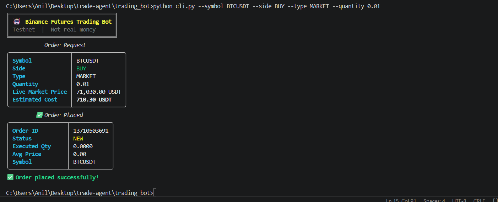
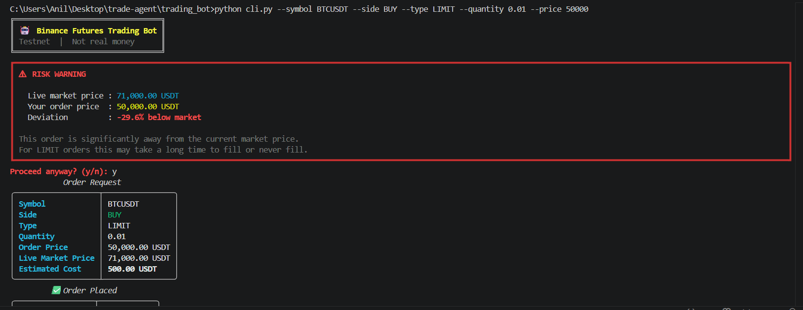
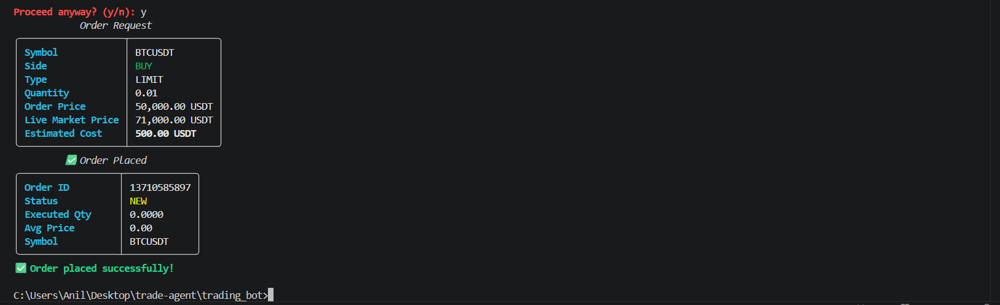
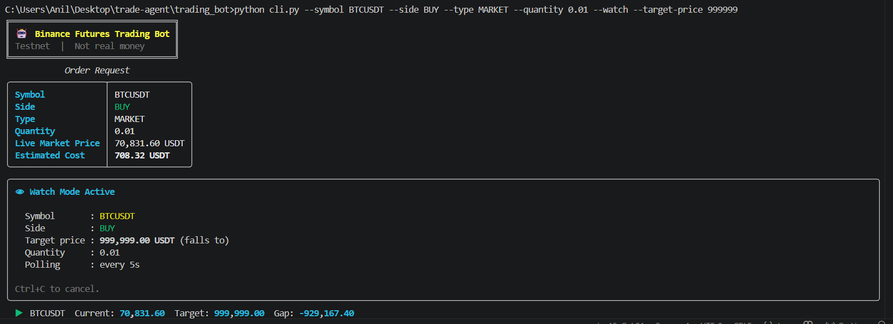
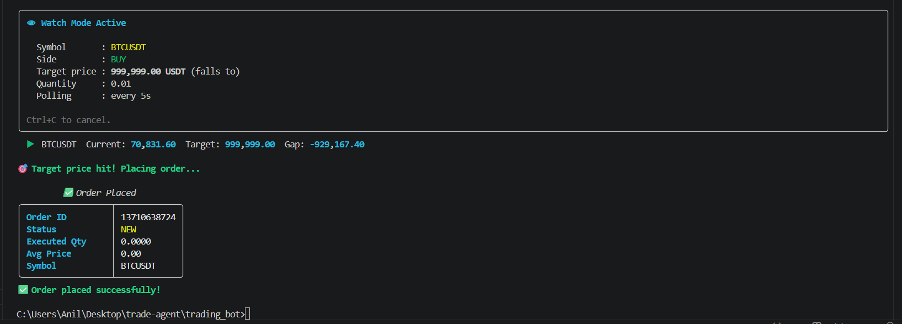

# 🤖 Binance Futures Trading Bot (Testnet)

A modular Python CLI trading bot for Binance Futures Testnet (USDT-M). Supports MARKET and LIMIT order execution for both BUY and SELL via a clean command-line interface.

Built as part of the Primetrade.ai Python Developer internship assignment — and extended with production-inspired features including live risk validation, dry-run simulation, price-triggered watch mode, and structured JSON logging.

---

## Screenshots
## Screenshots






---

## Project Structure

```
trading_bot/
├── bot/
│   ├── __init__.py
│   ├── client.py          # Binance API client — auth, HMAC signing, HTTP requests
│   ├── orders.py          # Order placement, dry-run logic, risk deviation check
│   ├── validators.py      # All input validation — symbol, side, type, qty, price
│   └── logging_config.py  # Structured JSON file logger + clean console handler
├── cli.py                 # CLI entry point — argparse + interactive guided mode
├── logs/                  # Auto-created — JSON structured log files per day
├── .env                   # Your API credentials (never committed)
├── .env.example           # Template showing required keys
├── .gitignore
├── requirements.txt
└── README.md
```

---

## Setup

### 1. Clone the repository
```bash
git clone https://github.com/YOUR_USERNAME/trading-bot.git
cd trading-bot
```

### 2. Install dependencies
```bash
pip install -r requirements.txt
```

### 3. Configure API credentials

Copy `.env.example` to `.env` and fill in your keys:
```bash
cp .env.example .env
```

```env
BINANCE_API_KEY=your_api_key_here
BINANCE_API_SECRET=your_secret_key_here
BINANCE_BASE_URL=https://demo-fapi.binance.com
```

> Get free API keys from [Binance Demo Trading](https://www.binance.com/en/futures/BTCUSDT) — Account → API Management → Create API. No KYC required, no real money involved.

---

## How to Run

### Direct command mode

**Market BUY:**
```bash
python cli.py --symbol BTCUSDT --side BUY --type MARKET --quantity 0.01
```

**Market SELL:**
```bash
python cli.py --symbol ETHUSDT --side SELL --type MARKET --quantity 0.1
```

**Limit BUY:**
```bash
python cli.py --symbol BTCUSDT --side BUY --type LIMIT --quantity 0.01 --price 50000
```

**Limit SELL:**
```bash
python cli.py --symbol BTCUSDT --side SELL --type LIMIT --quantity 0.01 --price 99000
```

---

### Dry Run — simulate without placing a real order
```bash
python cli.py --symbol BTCUSDT --side BUY --type MARKET --quantity 0.01 --dry-run
```

Fetches the live market price and shows estimated trade cost. No order is sent to the exchange.

Example output:
```
Estimated cost: 727.38 USDT
Live price used: 72,738 USDT
No order was placed on the exchange.
```

---

### Watch Mode — auto-trigger when price hits your target
```bash
python cli.py --symbol BTCUSDT --side BUY --type MARKET --quantity 0.01 --watch --target-price 60000
```

Polls live price every 5 seconds. Automatically places the order the moment BTCUSDT drops to 60,000 USDT. Press `Ctrl+C` to cancel.

Example output:
```
👁  BTCUSDT  Current: 72,640  Target: 60,000  Gap: -12,640
👁  BTCUSDT  Current: 71,980  Target: 60,000  Gap: -11,980
🎯 Target price hit! Placing order...
```

You can combine with `--dry-run` to test watch mode safely:
```bash
python cli.py --symbol BTCUSDT --side BUY --type MARKET --quantity 0.01 --watch --target-price 999999 --dry-run
```

---

### Interactive Mode — guided prompts, no flags needed
```bash
python cli.py
```

Walks you through every field interactively with a confirmation step before placing any order. Best for manual one-off trades.

---

## Features

| Feature | Description |
|---|---|
| ✅ Market Orders | Instant execution at current market price |
| ✅ Limit Orders | Execute at a specified price with GTC time-in-force |
| ✅ BUY / SELL | Both sides supported for all order types |
| ✅ Input Validation | Catches invalid symbols, sides, types, quantities, prices before any API call |
| ✅ Structured Logging | JSON logs written to `logs/` for every request, response, warning, and error |
| ✅ Rich CLI Output | Colored tables, panels, and clear success/failure messages |
| ✅ Interactive Mode | Run with no arguments for step-by-step guided input |
| ⚡ Dry Run Mode | Preview trade cost using live price — no order sent (`--dry-run`) |
| ⚡ Risk Warning | Warns if your limit price deviates >10% from live market price |
| ⚡ Watch Mode | Monitors live price every 5s and auto-triggers order at target (`--watch`) |
| ⚡ Live Cost Estimate | Shows estimated USDT cost before every order using real-time price |

---

## Validation & Error Handling

All inputs are validated before any API call is made:

```bash
# Missing price for LIMIT order
python cli.py --symbol BTCUSDT --side BUY --type LIMIT --quantity 0.01
# ❌ Validation Error: Price is required for LIMIT orders

# Unsupported symbol
python cli.py --symbol DOGEUSDT --side BUY --type MARKET --quantity 0.01
# ❌ Validation Error: Invalid symbol 'DOGEUSDT'. Supported: BTCUSDT, ETHUSDT...

# Negative quantity
python cli.py --symbol BTCUSDT --side BUY --type MARKET --quantity -5
# ❌ Validation Error: Quantity must be greater than 0

# Watch mode without target price
python cli.py --symbol BTCUSDT --side BUY --type MARKET --quantity 0.01 --watch
# ❌ --watch requires --target-price
```

Network errors, timeouts, and Binance API errors are all caught and shown with clear messages — the bot never crashes with a raw traceback on expected failures.

---

## Logging

Logs are written to `logs/trading_bot_YYYYMMDD.log` automatically.

Each log line is structured JSON — easy to parse, grep, or pipe into monitoring tools:

```json
{"timestamp": "2026-06-01 11:48:18 UTC", "level": "INFO", "module": "orders", "function": "place_order", "message": "Placing order | MARKET BUY BTCUSDT qty=0.01"}
{"timestamp": "2026-06-01 11:48:19 UTC", "level": "DEBUG", "module": "client", "function": "post", "message": "Response | orderId=13687874771 status=NEW"}
{"timestamp": "2026-06-01 11:48:19 UTC", "level": "INFO", "module": "orders", "function": "place_order", "message": "Order success | orderId=13687874771 status=NEW executedQty=0.0"}
```

What gets logged:
- Every API request and response (DEBUG)
- Order placement and confirmation (INFO)
- Validation failures and risk warnings (WARNING)
- Network errors and API errors (ERROR)

Console only shows WARNING and above — file gets everything.

---

## Supported Symbols

`BTCUSDT` · `ETHUSDT` · `BNBUSDT` · `SOLUSDT` · `XRPUSDT`

---

## Dependencies

| Package | Version | Purpose |
|---|---|---|
| `requests` | 2.32.3 | HTTP calls to Binance REST API |
| `python-dotenv` | 1.0.1 | Load API keys from `.env` |
| `rich` | 13.7.1 | Terminal formatting — tables, panels, colors |

---

## Assumptions

- Supported symbols are limited to the 5 most liquid USDT-M pairs
- Risk deviation threshold is 10% — configurable via `RISK_DEVIATION_THRESHOLD` in `orders.py`
- Watch mode polls every 5 seconds — intentional to stay within API rate limits
- `timeInForce` for LIMIT orders defaults to GTC (Good Till Cancelled)
- Used Binance Demo Trading environment (`demo-fapi.binance.com`) — Binance's current recommended testnet, more stable than the older `testnet.binancefuture.com`
- All prices are in USDT

---

## Architecture

```
cli.py  (entry point)
   │
   ├── validators.py     validates all user input
   │
   ├── orders.py         builds order params, handles dry-run, calls client
   │        │
   │        └── client.py    signs requests, talks to Binance API, handles HTTP errors
   │
   └── logging_config.py    structured JSON logger used across all modules
```